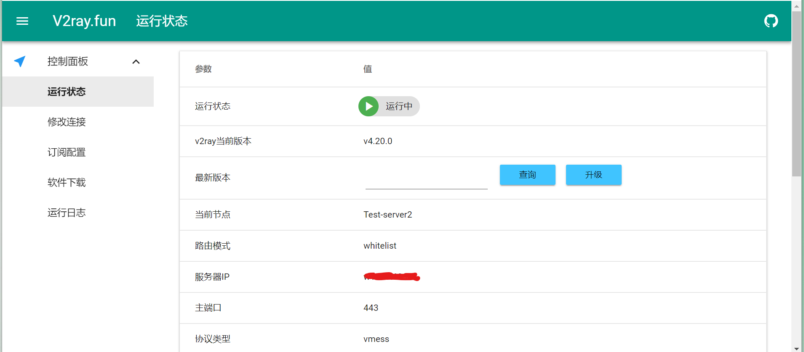
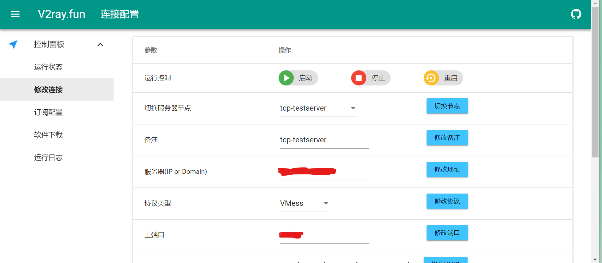
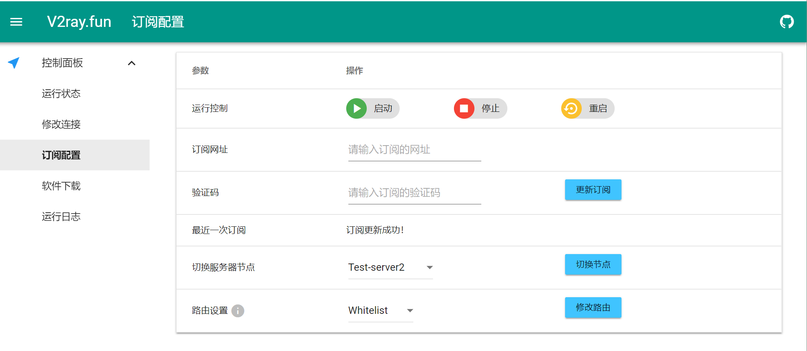

使用方法，路由器局域网ip设置为192.168.99.1，关闭路由器LAN口的dhcp功能。将设置好的树莓派用网线连接路由器上去。即可。
推荐使用一个单独的路由器，做为从路由配合树莓派使用。路由器性能不做要求，能正常使用就可。

特别注意：连接到此路由器的设备网络连接属性设置必须为自动获取DNS，网关，和IP地址

使用效果，树莓派与路由器组成透明翻墙网关，只要是连接到这个路由中的设备，自动翻墙，无需再安装设置翻墙软件。本例所配置的json为白名单。
使用v2ray自带的国内IP列表与国内常用网站domain列表。列表中的网站与IP直连。不在列表中的走代理网络。DNS使用v2ray内置查询，国内外网站自动分流。

---------------------安装步骤--------------------------------

https://github.com/MassSmith/smgate/wiki

如果不想按上述教程安装，这里是已经安装好的系统镜像。

https://raw.githubusercontent.com/MassSmith/smgate/master/v2raygate.imz

镜像使用方法：

1。写入到TF卡。

2。TF卡插入树莓派，用网线与路由器连接好。路由器能正常联网。

3。进入路由器，设置LAN口IP地址为：192.168.99.1。关闭LAN口的DHCP功能。

4。启动树莓派，重新启动路由器。其它设备连接路由器。即可。

5。镜像内自带一个v2ray节点，仅供参考与测试用，不做任何保证。随时可能关闭或被封掉。正常使用，请更换为自己的v2ray节点。

镜像说明：

以debian 9制作，集成了V2ray.Fun（项目地址：https://github.com/FunctionClub/V2ray.Fun ）可用web网页进行修改v2ray节点。原项目是用于远程服务端，于是做了修改，专用于树莓派网关。感谢V2ray.Fun的作者。

镜像运行WEB界面：

******************************************添加订阅的格式文件************************************
以下linux系统中操作命令，windows可使用Zip软件：

zip -P 999999999 subscribe.list.zip subscribe.list

https://github.com/MassSmith/test/raw/master/subscribe.list.zip

验证码：999999999
